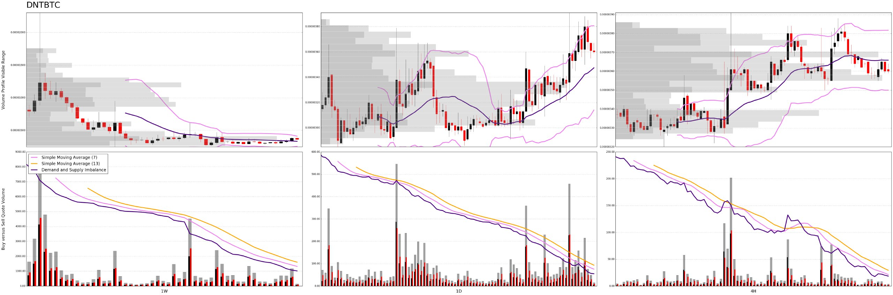
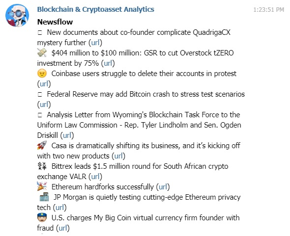

# Trading Analysis Bot

[](https://opensource.org/licenses/MIT)


A Telegram chatbot for data-driven analytics of crypto-market on Binance.
- Links: [Homepage](https://kenhtaichinh.herokuapp.com) [Chatbot](https://t.me/trading_analysis_bot)
- Archive: [v1.0](https://github.com/trinhvv/trading-analysis-bot/tree/5ed3707b769b85706ea2072667357e7d5fa721b3) [v2.0](https://github.com/trinhvv/trading-analysis-bot/commit/312dbe918b019d5d663e5a73e2662f30b86d048e)

## Features

- Altcoin analysis: Demand versus supply imbalance.
- Market movement: Statistics, Indexes (Bletchley, CRIX).
- Bitcoin metrics: NVT (Ratio/Signal), MVRV (Z-Score), Network momentum.
- Newsflow: Curated articles, Project profiles.
- Access control

## Deployment

### Local Machine

```
pip install -r requirements.txt
```

```
# For Windows
set TELEGRAM_TOKEN=XXXXXXXXXXXXXXXXXXXXXXXXXXXXXX 
set BINANCE_SECRET_KEY=XXXXXXXXXXXXXXXXXXXXXXXXXXXXXX 
set BINANCE_API_KEY=XXXXXXXXXXXXXXXXXXXXXXXXXXXXXX
set TELEGRAM_ADMIN_USERNAME=XXXXXXXXXXXXXXXXXXXXXXXXXXXXXX
python bot.py
```

```
# For Linux
export TELEGRAM_TOKEN=XXXXXXXXXXXXXXXXXXXXXXXXXXXXXX 
export BINANCE_SECRET_KEY=XXXXXXXXXXXXXXXXXXXXXXXXXXXXXX 
export BINANCE_API_KEY=XXXXXXXXXXXXXXXXXXXXXXXXXXXXXX
export TELEGRAM_ADMIN_USERNAME=XXXXXXXXXXXXXXXXXXXXXXXXXXXXXX
python bot.py
```

### Heroku

```
# Initialize
heroku create trading-analysis-bot --buildpack heroku/python
heroku config:set TELEGRAM_TOKEN=XXXXXXXXXXXXXXXXXXXXXXXXXXXXXX
heroku config:set BINANCE_SECRET_KEY=XXXXXXXXXXXXXXXXXXXXXXXXXXXXXX 
heroku config:set BINANCE_API_KEY=XXXXXXXXXXXXXXXXXXXXXXXXXXXXXX
heroku config:set TELEGRAM_ADMIN_USERNAME=XXXXXXXXXXXXXXXXXXXXXXXXXXXXXX
git push heroku master
heroku ps:scale bot=1 
```

## Screenshots

### Market Statistics

```
/m
```

```
#MARKET 
ALTS: 112 (+) 22 (-)
BTC: 58 (+) 87 (-)
USDⓈ: 11 (+) 66 (-)
BNB: 28 (+) 54 (-)
Sat Mar  2 19:31:57 2019
```

### Supply and Demand Analysis

```
/t fet
```



### Asset Analysis

```
/s fet
```

```
#FETUSDT 39,188,999.37 (52.65%)
P: 0.30930000 V: 12,489,154.73
30 mins: Buy 54,471.25, Sell 115,465.21
15 mins: Buy 17,700.61, Sell 63,930.01
5 mins: Buy 10.90, Sell 32.13
#FETBTC 31,886,561.00 (42.84%)
P: 0.00008003 V: 2,636.02
30 mins: Buy 18.80, Sell 34.01
15 mins: Buy 11.24, Sell 27.55
5 mins: Buy 0.00, Sell 0.14
#FETBNB 3,359,765.30 (4.51%)
P: 0.02221000 V: 79,102.74
30 mins: Buy 1,231.00, Sell 1,602.24
15 mins: Buy 493.52, Sell 505.07
5 mins: Buy 102.12, Sell 1.69
```

### Newsflow

```
/n
```




## Licence
MIT

## Support

- Star and/or fork this repository.
- Start trading on [Binance](https://www.binance.com/?ref=13339920), [Huobi](https://www.huobi.br.com/en-us/topic/invited/?invite_code=x93k3) or [Coinbase](https://www.coinbase.com/join/581a706d01bc8b00dd1d1737).
- Use the [Brave](https://brave.com/ken335) privacy browser to earn BAT token.
- BTC tipjar: [1DrEMhMP5rAytKyKXRzc6szTcUX8bZzZgq](1DrEMhMP5rAytKyKXRzc6szTcUX8bZzZgq).
