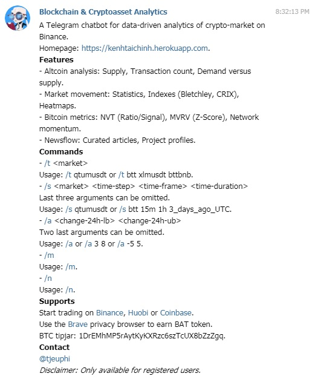
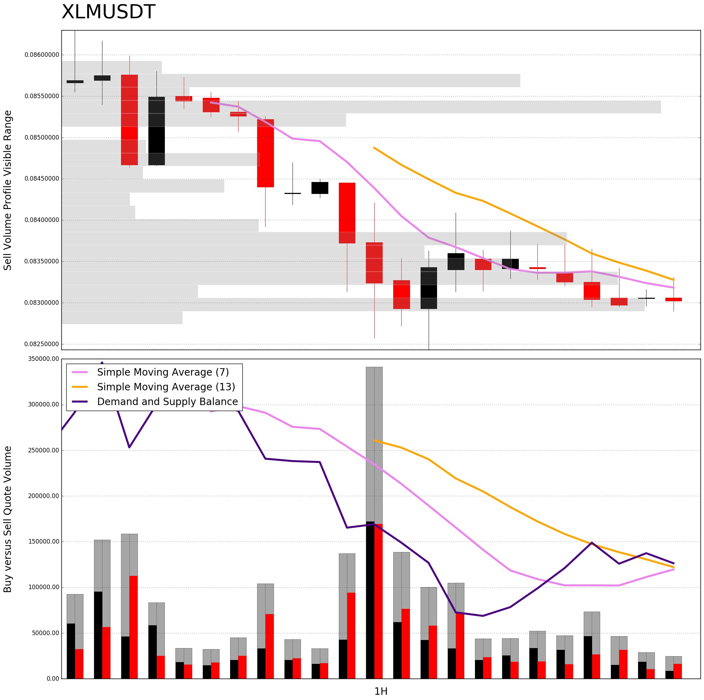

# Trading Analysis Bot

[](https://opensource.org/licenses/MIT)


A Telegram chatbot for data-driven analytics of crypto-market on Binance.
- Links: [Homepage](https://kenhtaichinh.herokuapp.com) [Chatbot](https://t.me/trading_analysis_bot)
- Archive: [v1.0](https://github.com/trinhvv/trading-analysis-bot/tree/5ed3707b769b85706ea2072667357e7d5fa721b3) [v2.0](https://github.com/trinhvv/trading-analysis-bot/commit/312dbe918b019d5d663e5a73e2662f30b86d048e)

## Features

- Altcoin analysis: Supply, Transaction count, Demand versus supply.
- Market movement: Statistics, Indexes (Bletchley, CRIX), Heatmaps.
- Bitcoin metrics: NVT (Ratio/Signal), MVRV (Z-Score), Network momentum.
- Newsflow: Curated articles, Project profiles.
- Access control

## Deployment

### Local Machine

```
pip install -r requirements.txt
```

```
# For Windows
set TELEGRAM_TOKEN=XXXXXXXXXXXXXXXXXXXXXXXXXXXXXX 
set BINANCE_SECRET_KEY=XXXXXXXXXXXXXXXXXXXXXXXXXXXXXX 
set BINANCE_API_KEY=XXXXXXXXXXXXXXXXXXXXXXXXXXXXXX
set TELEGRAM_ADMIN_USERNAME=XXXXXXXXXXXXXXXXXXXXXXXXXXXXXX
python bot.py
```

```
# For Linux
export TELEGRAM_TOKEN=XXXXXXXXXXXXXXXXXXXXXXXXXXXXXX 
export BINANCE_SECRET_KEY=XXXXXXXXXXXXXXXXXXXXXXXXXXXXXX 
export BINANCE_API_KEY=XXXXXXXXXXXXXXXXXXXXXXXXXXXXXX
export TELEGRAM_ADMIN_USERNAME=XXXXXXXXXXXXXXXXXXXXXXXXXXXXXX
python bot.py
```

### Heroku

```
# Initialize
heroku create trading-analysis-bot --buildpack heroku/python
heroku config:set TELEGRAM_TOKEN=XXXXXXXXXXXXXXXXXXXXXXXXXXXXXX
heroku config:set BINANCE_SECRET_KEY=XXXXXXXXXXXXXXXXXXXXXXXXXXXXXX 
heroku config:set BINANCE_API_KEY=XXXXXXXXXXXXXXXXXXXXXXXXXXXXXX
heroku config:set TELEGRAM_ADMIN_USERNAME=XXXXXXXXXXXXXXXXXXXXXXXXXXXXXX
git push heroku master
heroku ps:scale bot=1 
```

## Screenshots

### Manual

```
/help or /manual
```



### Market Statistics

```
/m
```

```
#MARKET 
ALTS: 112 (+) 22 (-)
BTC: 58 (+) 87 (-)
USDⓈ: 11 (+) 66 (-)
BNB: 28 (+) 54 (-)
Sat Mar  2 19:31:57 2019
```

### Supply and Demand Analysis

```
/t fet
```


### Scalping Analysis

```
/s xlmusdt
```

```
#XLMUSDT
P: 0.08302000 VWAP: 0.08420219 V: 2,149,121.50
30 mins: Buy 5,189.32, Sell 9,287.83
15 mins: Buy 1,535.70, Sell 2,095.77
5 mins: Buy 585.29, Sell 648.01
```



### Newsflow

```
/n
```


## Licence
MIT

## Support

- Star and/or fork this repository.
- Start trading on [Binance](https://www.binance.com/?ref=13339920), [Huobi](https://www.huobi.br.com/en-us/topic/invited/?invite_code=x93k3) or [Coinbase](https://www.coinbase.com/join/581a706d01bc8b00dd1d1737).
- Use the [Brave](https://brave.com/ken335) privacy browser to earn BAT token.
- BTC tipjar: [1DrEMhMP5rAytKyKXRzc6szTcUX8bZzZgq](1DrEMhMP5rAytKyKXRzc6szTcUX8bZzZgq).
