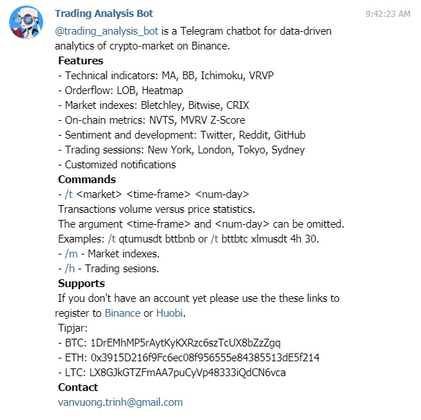
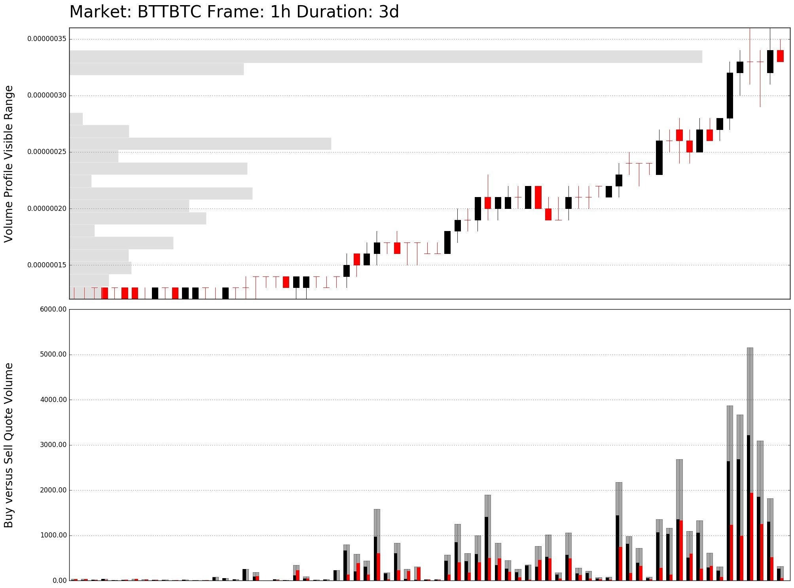
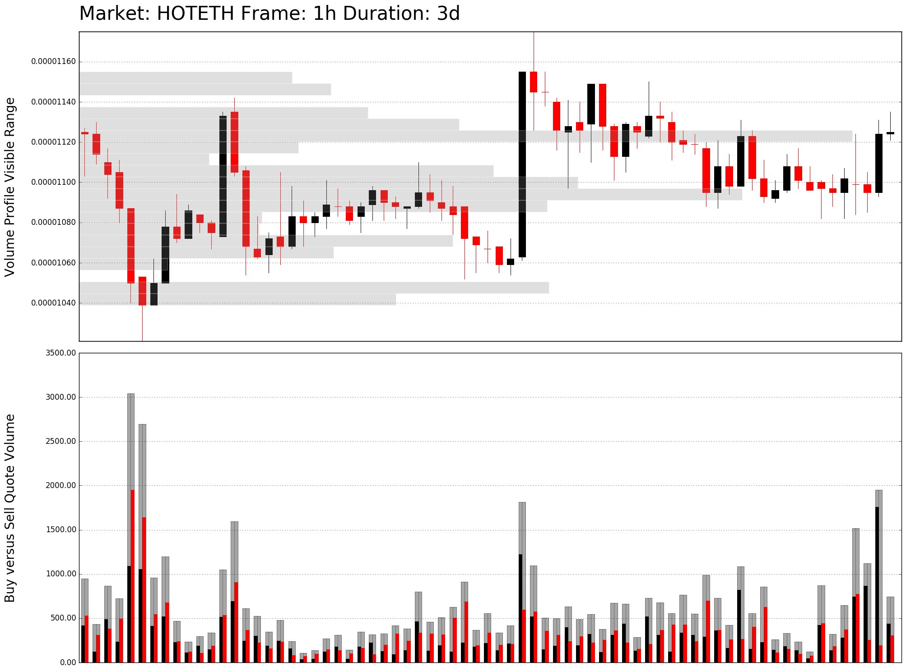
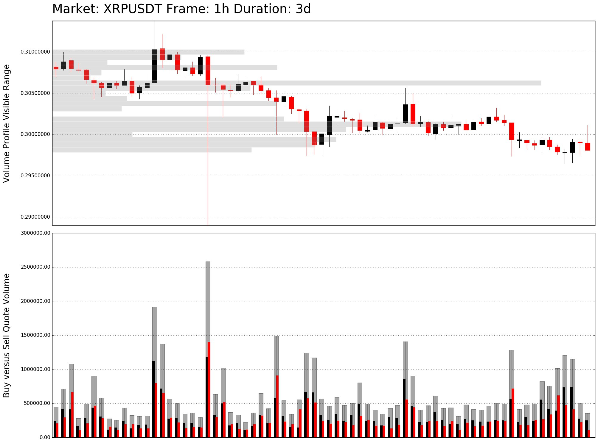

# Trading Analysis Bot

[](https://opensource.org/licenses/MIT)

<a href="https://t.me/trading_analysis_bot"></a>

**Trading Analysis Bot** is a Telegram chatbot for data-driven analytics of cryptocurrencies market, particularly the Binance exchange. It provides standard technical indicators, social sentiment and developer activities. Market indexes, rankings and statistic metrics based on on-chain transactions across different blockchain networks are also reported.

Verion 1.0 was archieved [here](https://github.com/trinhvv/trading-analysis-bot/tree/5ed3707b769b85706ea2072667357e7d5fa721b3).

## Requirements

- Telegram: python-telegram-bot
- Exchange: python-binance
- Numerical and data: numpy, pandas
- Visualization: matplotlib, seaborn

## Features

 - Technical indicators: MA, BB, Ichimoku, VRVP 
 - Orderflow: LOB, Heatmap, Supply Demand Analysis
 - Market indexes: Bletchley, Bitwise, CRIX 
 - On-chain metrics: NVTS, MVRV Z-Score
 - Sentiment and development: Twitter, Reddit, GitHub
 - Trading sessions: New York, London, Tokyo, Sydney
 - Customized notifications

## Run on local machine

```
pip install -r requirements.txt
```

```
# For Windows
set TELEGRAM_TOKEN=XXXXXXXXXXXXXXXXXXXXXXXXXXXXXX 
set BINANCE_SECRET_KEY=XXXXXXXXXXXXXXXXXXXXXXXXXXXXXX 
set BINANCE_API_KEY=XXXXXXXXXXXXXXXXXXXXXXXXXXXXXX
python bot.py
```

```
# For Linux
export TELEGRAM_TOKEN=XXXXXXXXXXXXXXXXXXXXXXXXXXXXXX 
export BINANCE_SECRET_KEY=XXXXXXXXXXXXXXXXXXXXXXXXXXXXXX 
export BINANCE_API_KEY=XXXXXXXXXXXXXXXXXXXXXXXXXXXXXX
python bot.py
```

## Deployment on Heroku platform

```
# Initialize
heroku create trading-analysis-bot --buildpack heroku/python
heroku config:set TELEGRAM_TOKEN=XXXXXXXXXXXXXXXXXXXXXXXXXXXXXX
heroku config:set BINANCE_SECRET_KEY=XXXXXXXXXXXXXXXXXXXXXXXXXXXXXX 
heroku config:set BINANCE_API_KEY=XXXXXXXXXXXXXXXXXXXXXXXXXXXXXX
git push heroku master
heroku ps:scale bot=1 
```

```
# Update
git add .
git commit -m "Commit time: `date +'%Y-%m-%d %H:%M:%S'`"
git push heroku master
```

## Screenshots

```
/help
```



```
/t btt hoteth xrpusdt 1h 3
```
```
#BTTBTC
P: 0.00000033 VWAP: -0.00000055 V: 33,989.78
30 mins: Buy 380.16, Sell 80.68
15 mins: Buy 57.69, Sell 15.03
5 mins: Buy 26.10, Sell 4.00
```



```
#HOTETH
P: 0.00001125 VWAP: 0.00001111 V: 17,399.01
30 mins: Buy 1,024.88, Sell 356.26
15 mins: Buy 292.66, Sell 189.94
5 mins: Buy 51.17, Sell 167.05
```



```
#XRPUSDT
P: 0.29832000 VWAP: 0.29999384 V: 15,777,651.16
30 mins: Buy 260,474.12, Sell 107,121.40
15 mins: Buy 24,027.64, Sell 33,808.34
5 mins: Buy 5,598.12, Sell 1,822.65
```



## Licence
MIT

## Support

- Star and/or fork this repository
- Trade on Binance: https://www.binance.com/?ref=13339920
- Trade on Huobi: https://www.huobi.br.com/en-us/topic/invited/?invite_code=x93k3
- Trade on Coinbase: https://www.coinbase.com/join/581a706d01bc8b00dd1d1737
-  Use the Brave privacy browser to earn BAT token: https://brave.com/ken335
- BTC tipjar: 1DrEMhMP5rAytKyKXRzc6szTcUX8bZzZgq
- ETH tipjar: 0x3915D216f9Fc6ec08f956555e84385513dE5f214
- LTC tipjar: LX8GJkGTZFmAA7puCyVp48333iQdCN6vca
